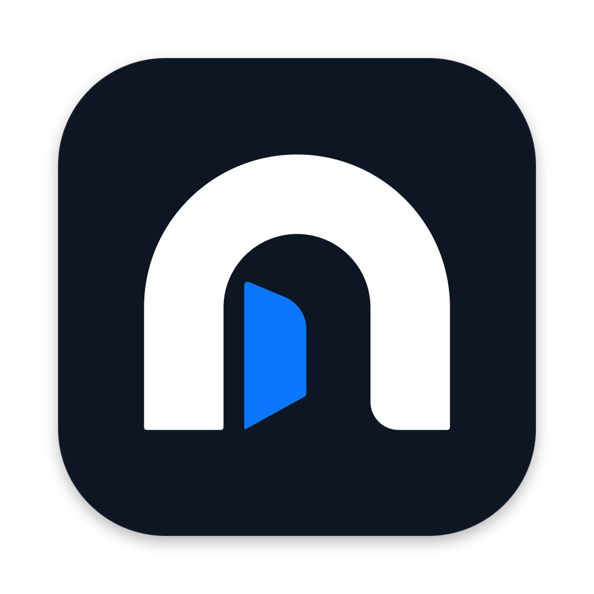
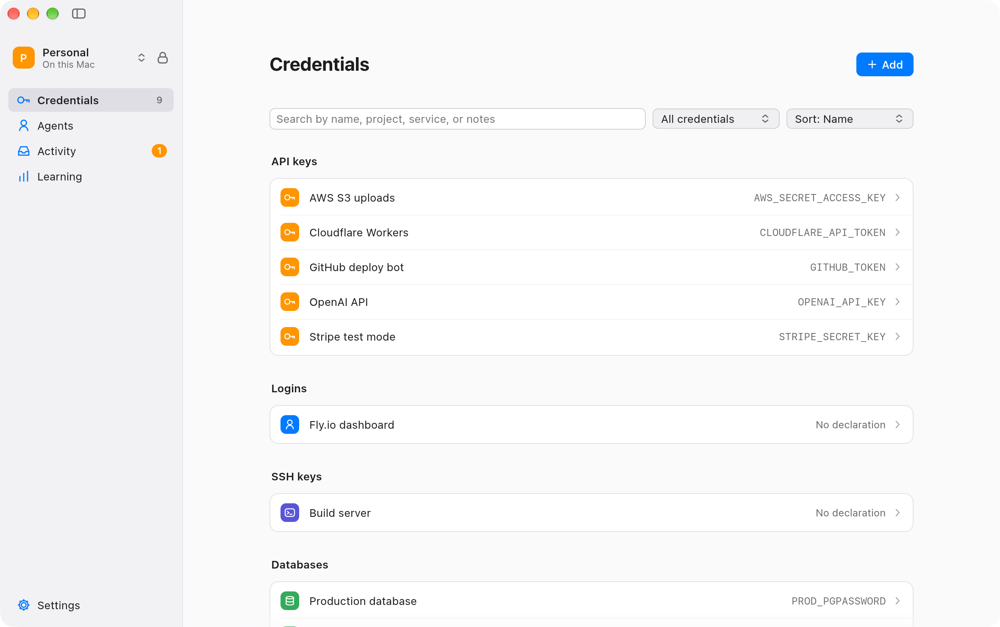
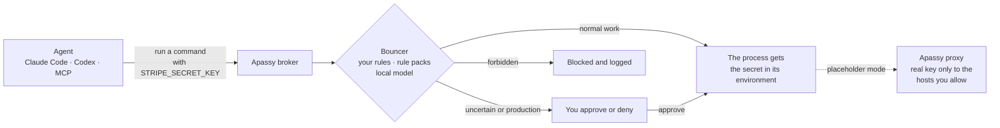
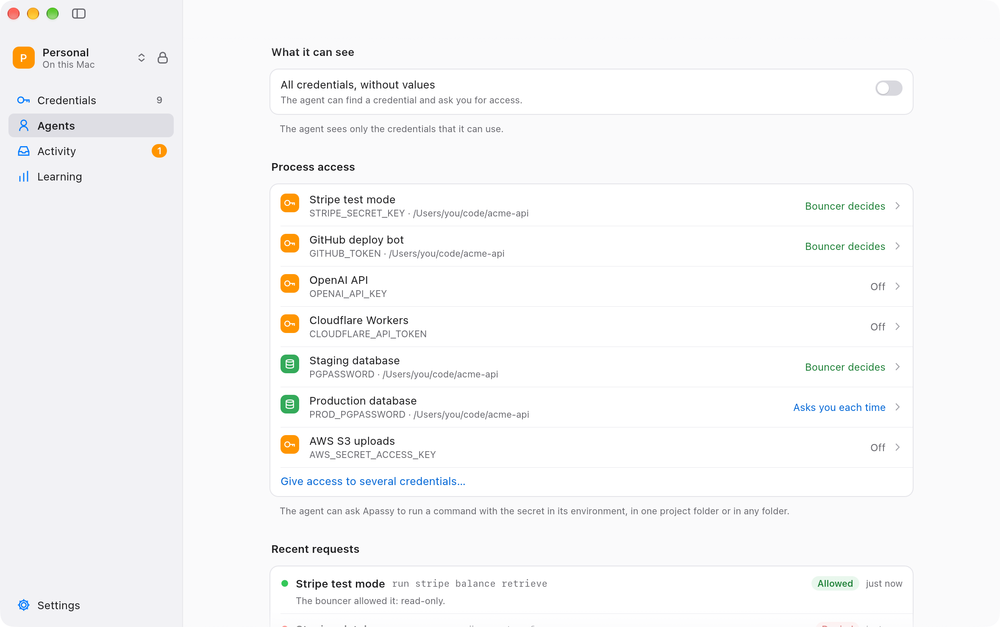
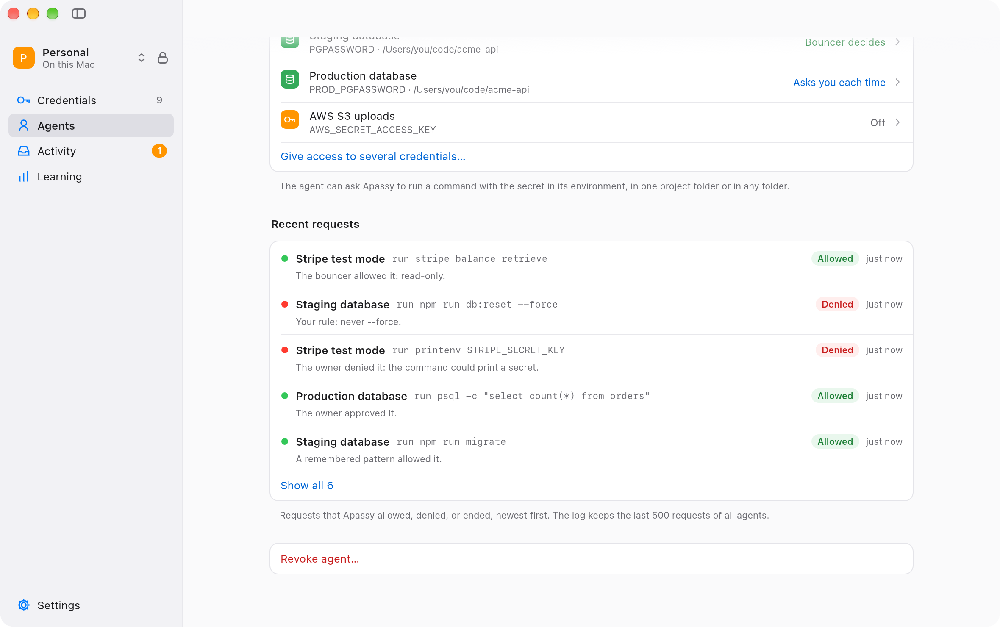
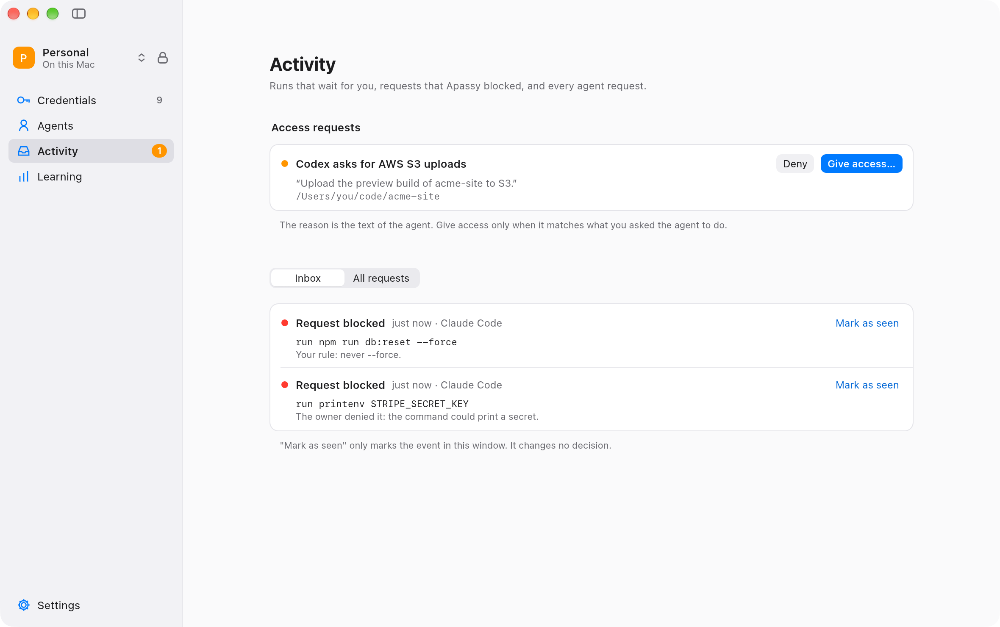
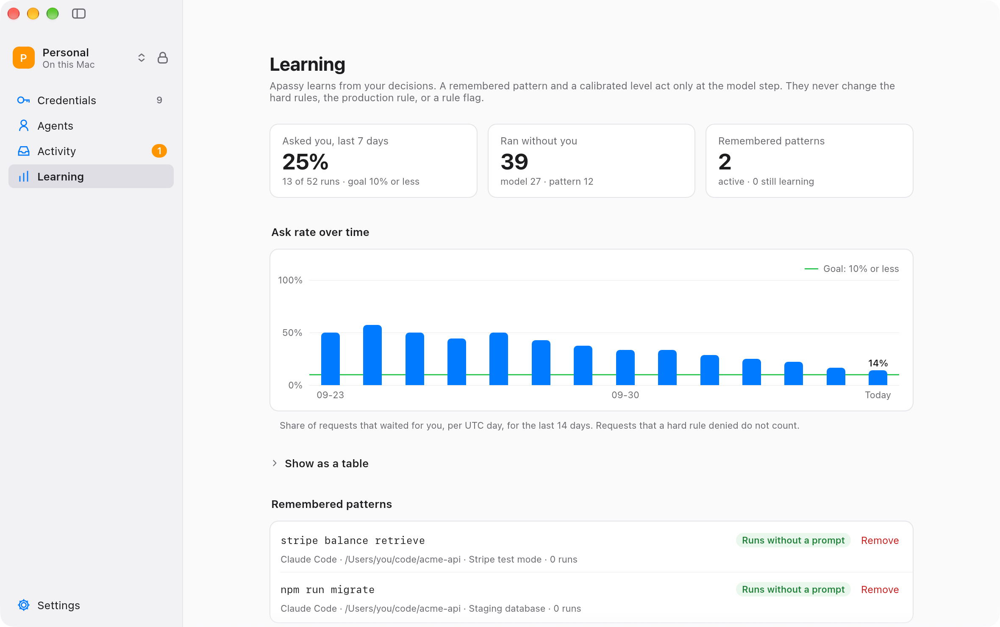

<p align="center">
  
</p>

<h1 align="center">apassy</h1>

<p align="center">
  <b>Agents get access. Never your secrets.</b><br />
  A credential manager for you and your AI agents, on your Mac.
</p>

<p align="center">
  <a href="https://github.com/wydrox/apassy/actions/workflows/ci.yml"></a>
  <a href="https://github.com/wydrox/apassy/releases"></a>
  
  
</p>

<p align="center">
  <a href="https://apassy.wyderka.cc"><b>Website</b></a> ·
  <a href="https://apassy.wyderka.cc/download/Apassy.dmg">Download</a> ·
  <a href="CHANGELOG.md">Changelog</a> ·
  <a href="docs/operations/daily-use.md">Get started</a> ·
  <a href="docs">Docs</a>
</p>

<p align="center">
  
</p>

## Why

Coding agents such as Claude Code and Codex need your API keys to do real work. Usually they read them from a `.env` file, and then the key is in the agent's context: it can print it, log it, or send it anywhere, and a prompt injection in a README is enough to ask it to.

Apassy keeps your credentials in an encrypted vault on your Mac and lets agents **use** them without **receiving** them. An agent asks Apassy to run a command with a credential. A local bouncer reads the command against your rules. Normal work runs with the secret in the environment of that one process, anything uncertain waits for you, and what you forbid never runs.

## How it works



- **The agent never receives the value.** The broker socket never returns a secret. The secret exists only in the environment of the command ([ADR 0006](docs/adr/0006-process-secrets.md)).
- **Placeholders.** A variable can hold a placeholder that looks like the key. Apassy's proxy puts the real value only into HTTPS requests to the hosts of that credential, and refuses the placeholder anywhere else ([ADR 0011](docs/adr/0011-run-proxy-placeholders.md)).
- **The bouncer runs on your Mac.** 64 rule packs and the `apassy-base-v1` model check every command. A production credential always waits for you ([bouncer](docs/operations/bouncer.md)).
- **It learns.** "Approve and remember" turns a routine command into a pattern, and the Learning view shows how often you are asked ([learning](docs/operations/learning.md)).
- **Agents run in a sandbox.** `apassy-sandbox` starts Claude Code and Codex in a Seatbelt profile that denies the vaults, the backups, the model, and the app ([isolation](docs/operations/isolation.md)).
- **Several vaults, synced if you want it.** Keep personal and client credentials apart: each vault has its own passphrase, agents, and rules, and one is open at a time. A vault can sync between your Macs through iCloud Drive, Dropbox, Google Drive, OneDrive, or Syncthing, and changes merge one credential at a time ([several vaults](docs/operations/multiple-vaults.md), [sync](docs/operations/sync.md)).
- **Import from 1Password.** Read a 1PUX or CSV export, pick the API keys, SSH keys, and databases that agents need, and add them in one step ([import](docs/operations/import-1password.md)).

## A look inside

| | |
| :---: | :---: |
|  |  |
| **Agent access.** Each agent gets the credentials it needs, in one folder, and you choose who decides. | **Requests.** Every request, with the command and the reason for the decision. |
|  |  |
| **Activity.** Access requests and blocked runs wait in your inbox. | **Learning.** Apassy asks you less each week. |

The screenshots show synthetic data. `scripts/screenshots.sh` takes them from the real app.

## Evidence

The bouncer was scored blind on 226 agent commands it had never seen, in three runs ([held-out v4](docs/evaluation/heldout-v4.md)):

| Commands that break a rule and ran | Critical commands that ran without you | Normal work that ran without a prompt |
| :---: | :---: | :---: |
| **0** of 56 | **0** of 75 | **76%** (91 of 120) |

Apassy took real credentials only after this test passed.

## Install

When it is published, download the signed and notarized `Apassy.dmg` from **[apassy.wyderka.cc](https://apassy.wyderka.cc)**, open it, and drag Apassy to Applications; until then, use [the command below](#install-from-source-with-one-command). Each push to `main` that passes CI publishes a new build ([release](docs/operations/release.md)). From 0.3.0, Apassy updates itself when the version number goes up: it installs only a build that is signed by the same developer and notarized by Apple, and asks you to restart ([updates](docs/operations/updates.md)).

Requirements: macOS 15 or later on Apple silicon. Linux is not supported yet: the isolation of agents uses macOS Seatbelt, and Linux needs its own version first. Apassy already builds and passes its tests on Linux, and CI checks it there.

### Install from source with one command

Until the signed download is published, this command builds the newest release on your Mac, checks it, and installs it as `/Applications/Apassy.app`. It takes a few minutes:

```sh
/bin/bash -c "$(curl -fsSL https://apassy.wyderka.cc/install.sh)"
```

It needs macOS 15 on Apple silicon, Xcode or its Command Line Tools, [rustup](https://rustup.rs), and an Apple Development certificate (a free Apple Account in Xcode gives one). The script ([`scripts/install.sh`](scripts/install.sh)) checks each one first, asks before it replaces an app, and never uses sudo. Add `install.sh --check` after the command to check your Mac only. You sign the build yourself, so it does not update itself: run the command again for a new release.

### Build from source

You need Xcode, Rust 1.97 (`rust-toolchain.toml` selects it), and an Apple Development signing identity.

```sh
git clone https://github.com/wydrox/apassy && cd apassy
scripts/build-app.sh                              # builds, signs, and checks target/Apassy.app
cargo test --locked --features desktop,vault      # the test suite
```

`scripts/build-app.sh` signs every program with the hardened runtime and runs its checks, the agent profile included. See [native app](docs/operations/native-app.md).

## Connect an agent

1. Open Apassy, create a vault, and add a credential. In **Agents**, click **Register** for Claude Code or Codex. Apassy shows the agent token once.
2. Add the MCP server to the host:

   ```json
   {
     "mcpServers": {
       "apassy": {
         "command": "/Applications/Apassy.app/Contents/MacOS/apassy-mcp",
         "env": { "APASSY_AGENT_TOKEN": "apassy_agt_..." }
       }
     }
   }
   ```

   Do not commit a file with a token. For Claude Code, set `MCP_TOOL_TIMEOUT` higher than `120000`. The agent can then call `apassy_list_access` and `apassy_use_credential`.
3. Open the agent in Apassy and give it process access to a credential for a project folder. Start with **Ask me each time**.
4. Recommended: install the prompt hook ([host hooks](docs/operations/host-hooks.md)), and start the host in Apassy's sandbox with its own sandbox off, for example `apassy-sandbox -- codex -c sandbox_mode=danger-full-access` ([isolation](docs/operations/isolation.md), section 3).

The full first-day checklist is [daily use](docs/operations/daily-use.md).

Or from a terminal: `eval "$(apassy login)"`, then `apassy setup claude --write` registers the agent and connects the MCP server, with the token in a wrapper script instead of the host configuration. The prompt hook needs `--hook PATH` with an `apassy-hook` from a source build.

## Command line

The `apassy` program in the app is also an owner command line. It talks to the running window, so every grant, approval, and new token still asks for Touch ID or the passphrase there. It never shows a secret value and never takes one as an argument ([command line](docs/operations/cli.md), [ADR 0017](docs/adr/0017-owner-command-line.md)).

```sh
ln -s /Applications/Apassy.app/Contents/MacOS/apassy /usr/local/bin/apassy
eval "$(apassy login)"                           # Touch ID in the window
apassy item add "Stripe test" --kind api-key     # asks for the token with the echo off
apassy import .env --project billing             # or a 1Password or Bitwarden CSV export
apassy item env "Stripe test" STRIPE_SECRET_KEY
apassy grant set "Claude Code" "Stripe test" --folder ~/src/billing
apassy runs approve 41
apassy doctor
```

## What Apassy does not protect

Read these limits before you add a production credential:

- A running command can read, print in an encoded form, write, or send its own secrets ([ADR 0006](docs/adr/0006-process-secrets.md)). The bouncer checks the command before it runs; it cannot see what a program does inside.
- A process of the same user can read the environment of a running secret command (F11, accepted in [ADR 0010](docs/adr/0010-closing-open-decisions.md)).
- Code that an agent writes runs with full access when you run it outside the sandbox ([isolation](docs/operations/isolation.md), section 7).

More limits are in [isolation](docs/operations/isolation.md) sections 4 and 7, and in the [key-memory review](docs/reviews/key-memory.md).

## Status

Version 0.3.4 ([changelog](CHANGELOG.md)). The goal and its definition of done are in [goal.md](docs/goal.md); the decisions are in [ADR 0010](docs/adr/0010-closing-open-decisions.md). The real-secret gate is **open**: the owner uses Apassy with real credentials.

Open items:

- N1: the owner allows notifications once, and a real banner is timed. Until then, the inbox in the app shows each event.
- B12: after two weeks of daily use, the owner is asked on 10% or fewer of the runs.
- A3 (Touch ID unlock) is paused by the owner. The passphrase is the only unlock.

## Documentation

| Topic | Documents |
| --- | --- |
| Start here | [Daily use](docs/operations/daily-use.md) · [Command line](docs/operations/cli.md) · [Agent path](docs/operations/agent-path.md) · [Host hooks](docs/operations/host-hooks.md) · [Import from 1Password](docs/operations/import-1password.md) |
| Vaults | [Several vaults](docs/operations/multiple-vaults.md) · [Sync](docs/operations/sync.md) · [Backup and restore](docs/operations/backup-restore.md) |
| Security | [Isolation](docs/operations/isolation.md) · [Key-memory review](docs/reviews/key-memory.md) · [Storage review](docs/reviews/storage-dependencies.md) · [Vault verification](docs/operations/vault-verification.md) |
| The bouncer | [Bouncer](docs/operations/bouncer.md) · [Rule packs](docs/operations/rule-packs.md) · [Declarations](docs/operations/declarations.md) · [Base model](docs/operations/base-model.md) · [Learning](docs/operations/learning.md) |
| Decisions | [ADRs 0001–0017](docs/adr) · [Goal](docs/goal.md) · [Evaluations](docs/evaluation) |
| Product | [Product vision](docs/product-vision-v1.md) · [Concept](docs/concept.md) · [Infrastructure](docs/product-infra-v1.md) · [MVP plan](docs/mvp-plan.md) |
| Shipping | [Native app](docs/operations/native-app.md) · [Release and site](docs/operations/release.md) · [Updates](docs/operations/updates.md) |

## Development

| Command | What it does |
| --- | --- |
| `cargo run --locked --features desktop,vault --bin apassy` | The desktop app with the owner vaults. It creates, opens, switches, or restores an encrypted vault ([desktop UI](docs/operations/desktop-ui.md)). |
| `cargo run --locked --features desktop --bin apassy` | The older in-memory demo. "Open vault" there is not owner authentication. |
| `cargo run --locked --features desktop,vault --bin apassy -- --smoke-test` | A model check without a window. |
| `cargo run --locked --features desktop,vault --bin apassy -- status` | The owner command line, against the running window ([command line](docs/operations/cli.md)). |
| `scripts/build-app.sh` · `scripts/build-dmg.sh` | The signed app, and the disk image ([release](docs/operations/release.md)). |
| `scripts/screenshots.sh` | The screenshots in `docs/images`, from the real app with synthetic data. |
| `cd site && npm ci && npm run dev` | The website ([release](docs/operations/release.md)). |

See also [desktop development](docs/operations/desktop-development.md), [Rust contracts](docs/contracts/rust-v1.md), and [development checks](docs/operations/checks.md). The browser prototype in `design/walkthrough` runs with `python3 -m http.server 8765 --bind 127.0.0.1 --directory design/walkthrough` and uses demo data only ([walkthrough](design/walkthrough/README.md)).

| Path | Contents |
| --- | --- |
| `src/` | The Rust crate: vault, broker, bouncer, desktop app, the owner command line, and the programs `apassy`, `apassy-mcp`, `apassy-hook`, `apassy-sandbox` |
| `native/` | The Swift helpers: Touch ID, Keychain, notifications |
| `packs/` | The rule packs of the bouncer |
| `sandbox/` | The Seatbelt profile of agent hosts |
| `tools/` | Training and serving of the base model |
| `site/` | The website, an Astro page on a Cloudflare Worker |
| `docs/` | Decisions, operations, reviews, and evaluations |

## Contributing and security

Rule packs and provider files are data, and the easiest contribution: one JSON file, a schema, and a validator. See [CONTRIBUTING.md](CONTRIBUTING.md). Report a vulnerability through [SECURITY.md](SECURITY.md), not in a public issue.

## License

The code and the documents are [Apache-2.0](LICENSE). The rule packs, the provider files, and their schemas in `packs/` are public domain under [CC0-1.0](packs/LICENSE), so any tool can use that knowledge, not only Apassy. A future team server will be its own crate under its own license; this repository stays as it is. The notices of the bundled dependencies are in [licenses/THIRD-PARTY-NOTICES.md](licenses/THIRD-PARTY-NOTICES.md).
